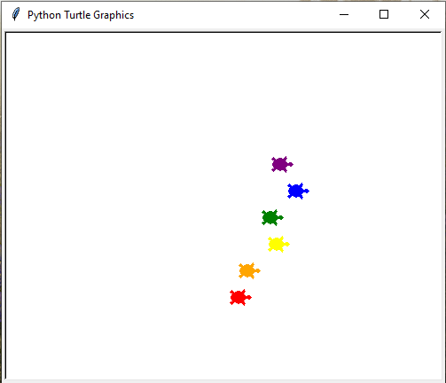

# Turtle race game using turtle graphics

## The game was part of a python course i was doing. It was a project in the course.

### How to run and play the game:

- Clone or download this repository to your local machine.
- Make sure you have Python installed.
- Run main.py to start the game.
- Choose any of these colors: red, orange, yellow, green, blue, purple.
- Don't keep any space while typing the color of your turtle.
- After the race is finished you can also close the game by clicking on turtle graphics window.

